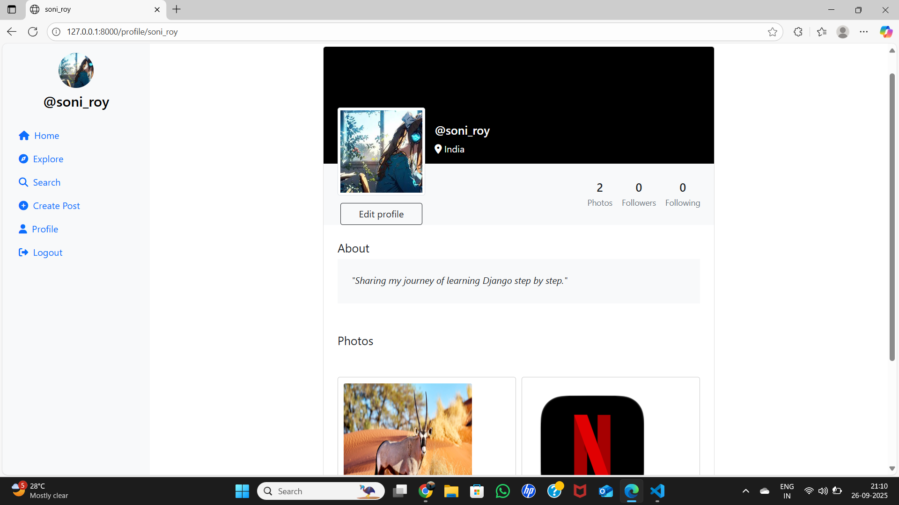

# Social_media_app
A social media web app built with Django framework featuring user authentication, profile management, posts, likes, and comments. Designed with responsive web UI and scalable backend to demonstrate modern web development using Python, Django, HTML, CSS, and JavaScript.

## Output

